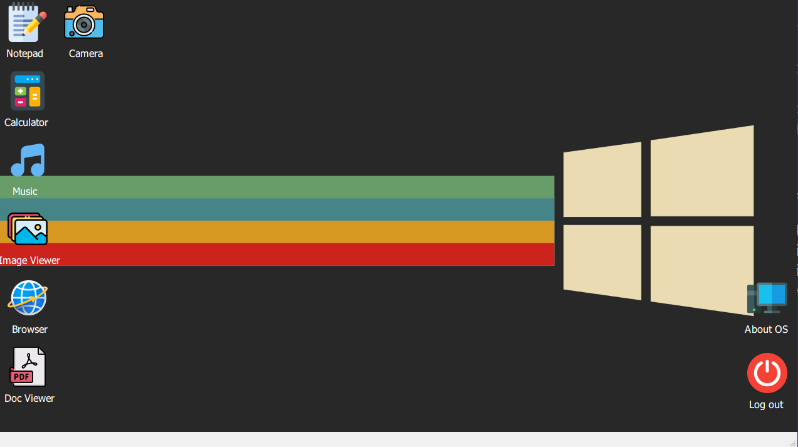

# DearthOS - Pseudo Operative System Prototype

DearthOS is a prototype of a pseudo-operating system created using Python and PyQt5. This project serves as a demonstration of basic OS-like functionality.



## Features

- **Login Screen**: A simple login interface for user authentication.
- **Browser**: A basic web browser interface.
- **Calculator**: A simple calculator application.
- **Camera**: A simple camera app.
- **Document Viewer**: An interface for viewing text-based documents.
- **Image Viewer**: A tool for viewing images.
- **Music Player**: A basic music player interface.
- **Notepad**: A simple text editor for basic note-taking.
  
## Installation

To run DearthOS locally, you will need Python installed on your machine. Follow the steps below:

1. Clone the repository:
   ```bash
    git clone https://github.com/Neutrovertido/DearthOS.git
    ```
2. Navigate to the project directory:
    ```bash
    cd DearthOS
    ```

3. Install the required dependencies:
    ```bash
    pip install -r requirements.txt
    ```

4. Run the main program or the login screen:
    ```bash
    python Main.py
    python Ui_Login.py
    ```

## Dependencies
This project uses PyQt5 for the graphical user interface and other Python libraries listed in `requirements.txt.` You can install all the dependencies via pip:

```bash
pip install -r requirements.txt
```

## License

This project is licensed under the [GPL-3.0 License](LICENSE).

## Contributing

If you'd like to contribute to DearthOS, feel free to fork the repository, make changes, and submit pull requests. All contributions are welcome!

## Acknowledgements

- PyQt5 for the GUI framework
- Python for the development of the system prototype
